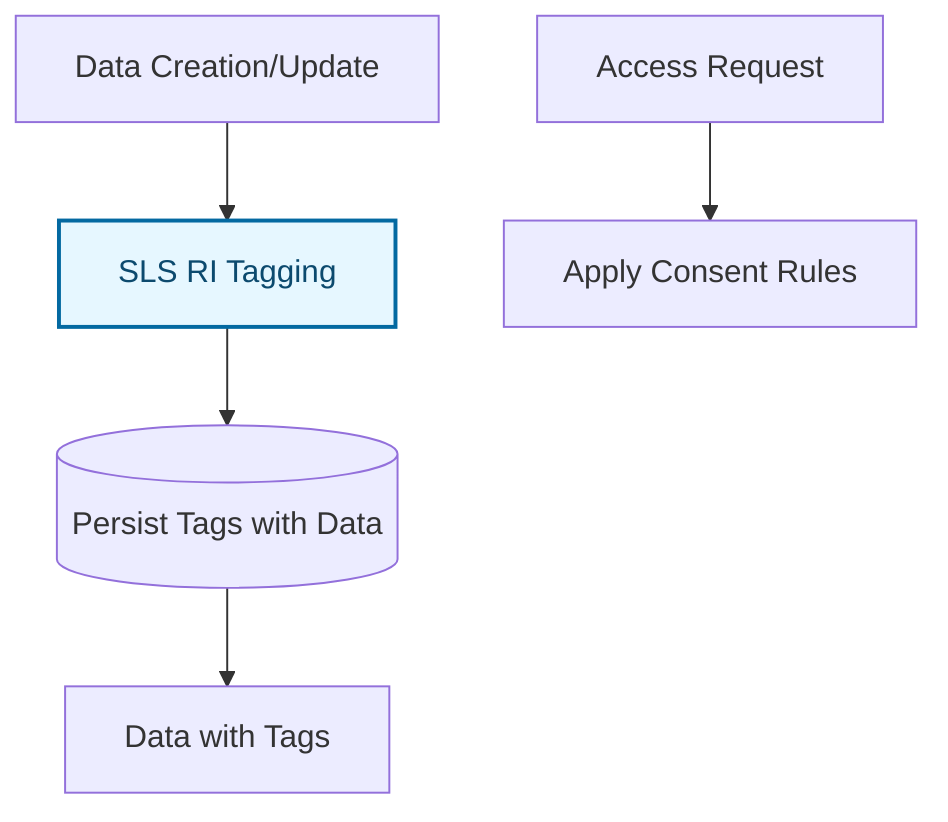
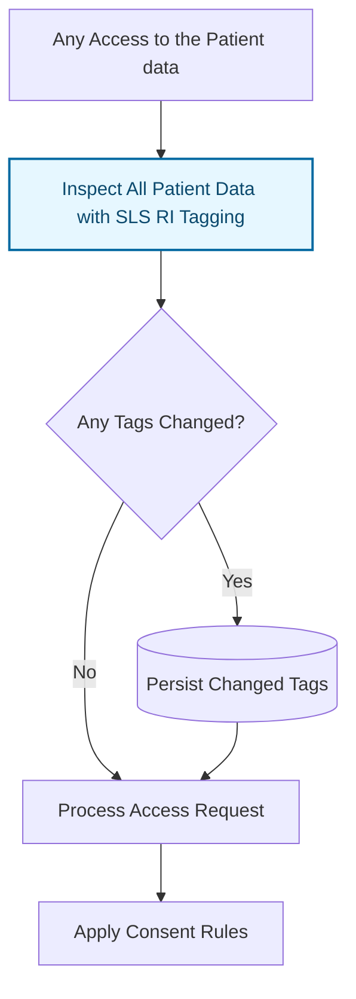
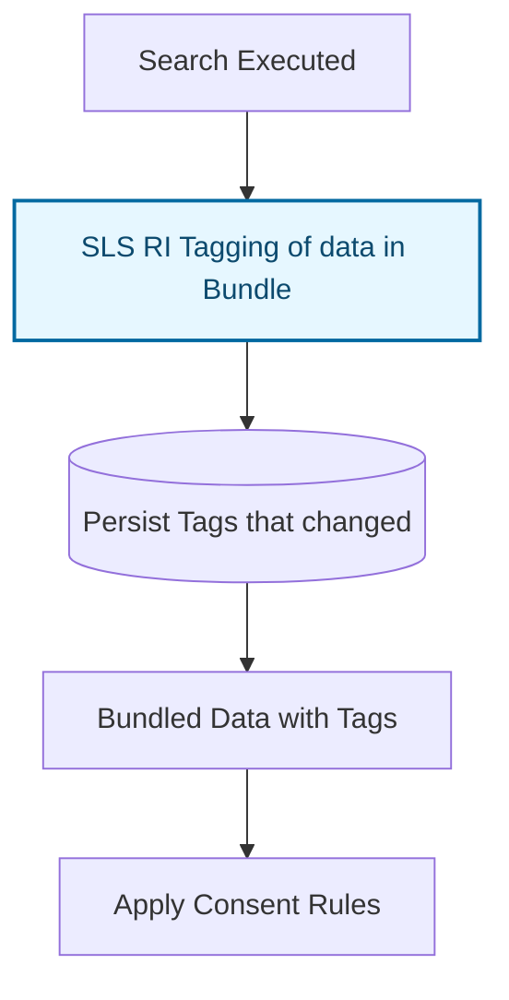
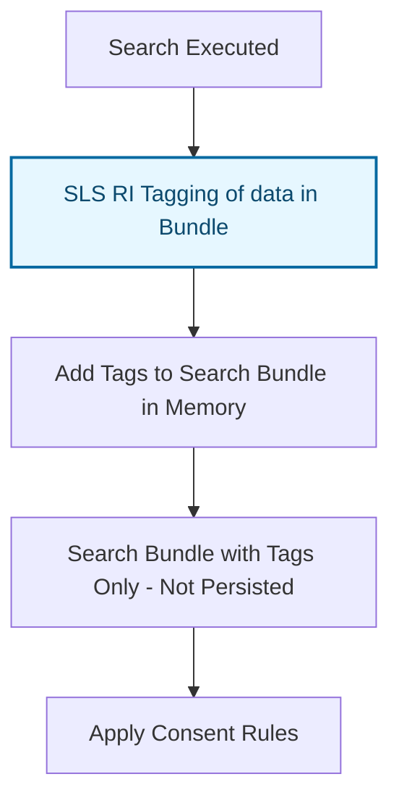

The SLS Reference Implementation is designed to provide a practical example of how to implement the Security Labeling Service (SLS) for Health Information tagging so that fine grain access controls can be implemented. Data tagging applies a categorization code to a FHIR resource based only on the content of that FHIR resource. The tag does not indicate what kind of access control is applied. The access control rules are separate.

### When is tagging needed?

1. Data does not need to be tagged if there is no access control policies (e.g. Consent, Business Rules, or Regulations) that would apply different rules to different categories of data.
2. Data does not need to be tagged if the current state of Consent is blanket permit or deny. That is when the Patient Consent has no specific rules per category then the tagging is not needed.
3. Data need only be tagged sufficient to support the categorization of the access control policies. **The SLS RI is configured by loading the SLS Policies as ValueSets**
4. When the tagging policies change (e.g. the SLS ValueSets are updated) then any data that was tagged under the old policy needs to be retagged. **The SLS RI implements a timestamp on the tags to allow for not retagging if the SLS policies have not changed since last tagging.**

The Reference Implementation of the SLS is designed to provide clarity of the concept of tagging. It is not designed to be fast or efficient. In a real-world system, the tagging of the data would be designed into the system utilizing features of that system (e.g., leveraging database indexing).

### When to apply the SLS RI?

Executing the SLS against any data is an expensive operation. This is true as the number of entries in the SLS policies increases. The SLS must look at all codes in the data and detect if any of the codes match any of the configured SLS policies. Thus the more policies (ValueSets) and the more entries in those ValueSets, the more computationally expensive the tagging process becomes. The SLS RI includes a timestamp so that data are not inspected unless the data timestamp is older than the SLS Policies. [See ValueSet Profile](index.html#valueset-profile)

There is a concern with legacy databases not having an element to hold the security tags. Thus there needs to be a way to support SLS in those cases.

There are a few ways to apply the SLS RI:

#### Executed on all data Creation and Update

This is the most comprehensive approach, ensuring that all data is tagged appropriately. However, it may have performance implications due to the need to tag every resource. It also relies on the system being able to persist the tags with the data. This approach also must retag data when the tagging policy (e.g. SLS ValueSets) changes.

#### Executed on demand when a Patient's data are accessed

When a Patient's data are accessed, a task examines all of that Patient's data and applies the appropriate tags. This approach allows for dynamic tagging based on the current state of the data and the applicable access control policies. However, it may lead to performance issues due to the need to tag data at the time of access, which could introduce latency. It also relies on the system being able to persist the tags with the data. This approach has the benefit of not changing data to add tags unless that Patient is actively being accessed. Thus historic patients that are no longer being accessed would not need to be tagged.

#### Executed on demand with each Search with writeback

When a search is executed, the SLS RI is executed to inspect the Search Bundle and any new tags are written back to the database. This approach allows for dynamic tagging based on the current state of the data and the applicable access control policies at the time of search. However, it may lead to significant performance issues due to the need to tag data at the time of search, which could introduce latency. It also relies on the system being able to persist the tags with the data. This approach has the benefit of not changing data to add tags unless that data is actively being searched for. This inspection of the Search Bundle would only be done if the Access Control decision has residual rules to further remove categories of sensitive data. 

#### Executed on demand with each Search doing only inline tagging

When a search is executed, the SLS RI is executed to inspect the Search Bundle and any new tags are only added to the Search Bundle in memory and not written back to the database. This approach allows for dynamic tagging based on the current state of the data and the applicable access control policies at the time of search without changing the underlying data. However, it may lead to performance issues due to the need to tag data at the time of search, which could introduce latency. This approach has the benefit of not changing data to add tags unless that data is actively being searched for and does not require that the system be able to persist the tags with the data. This inspection of the Search Bundle would only be done if the Access Control decision has residual rules to further remove categories of sensitive data.

